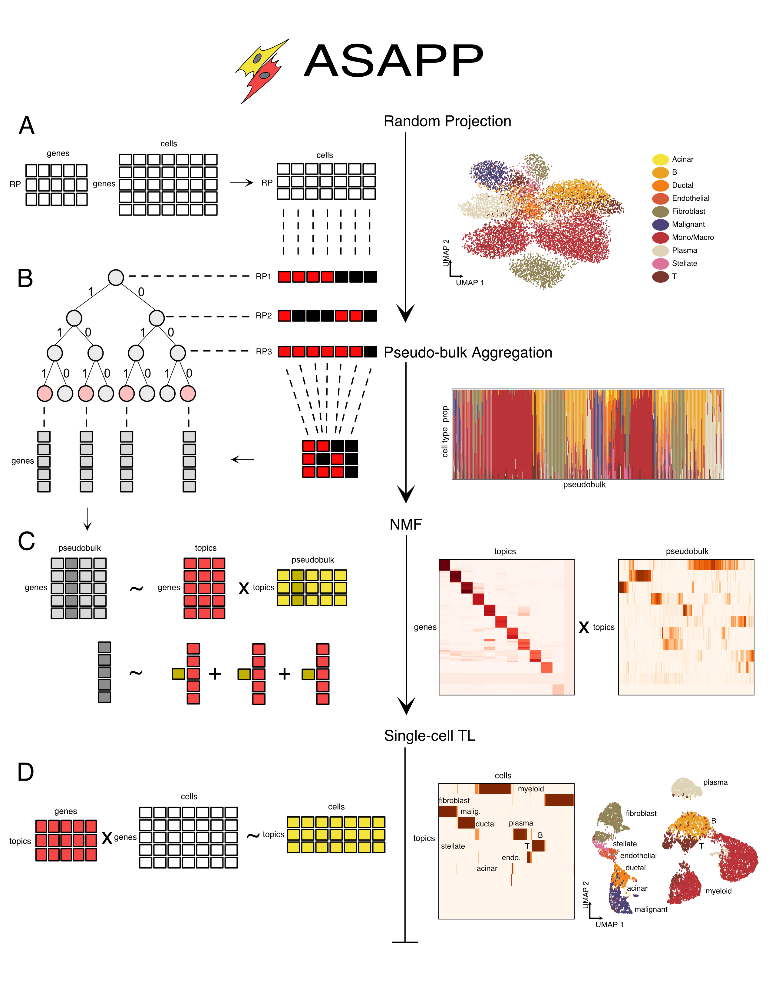

## ASAPP : Annotation of Single-cell data by Approximate Pseudo-bulk projection

    

OS requirements for pip installation:

- sudo apt install cmake
- sudo apt install libeigen3-dev
- sudo apt-get install libboost-all-dev
