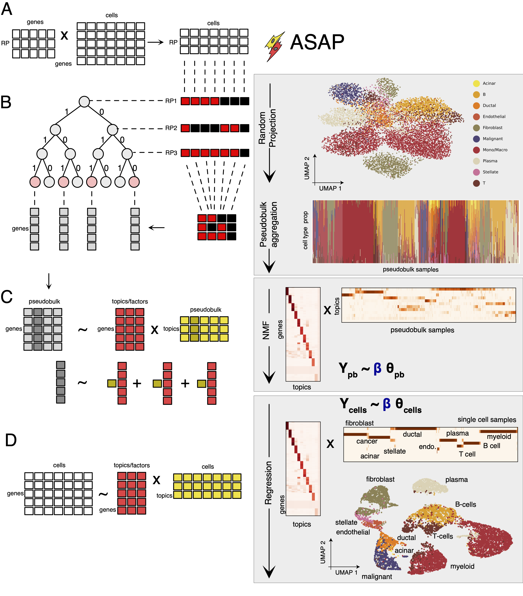
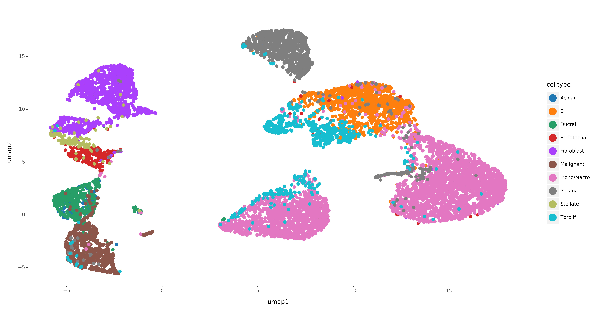
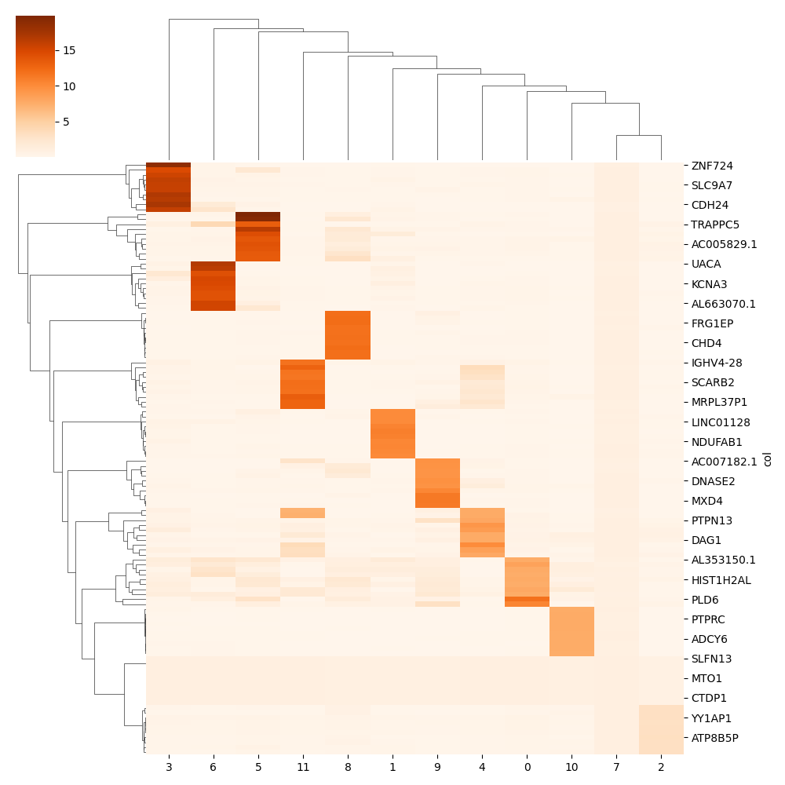
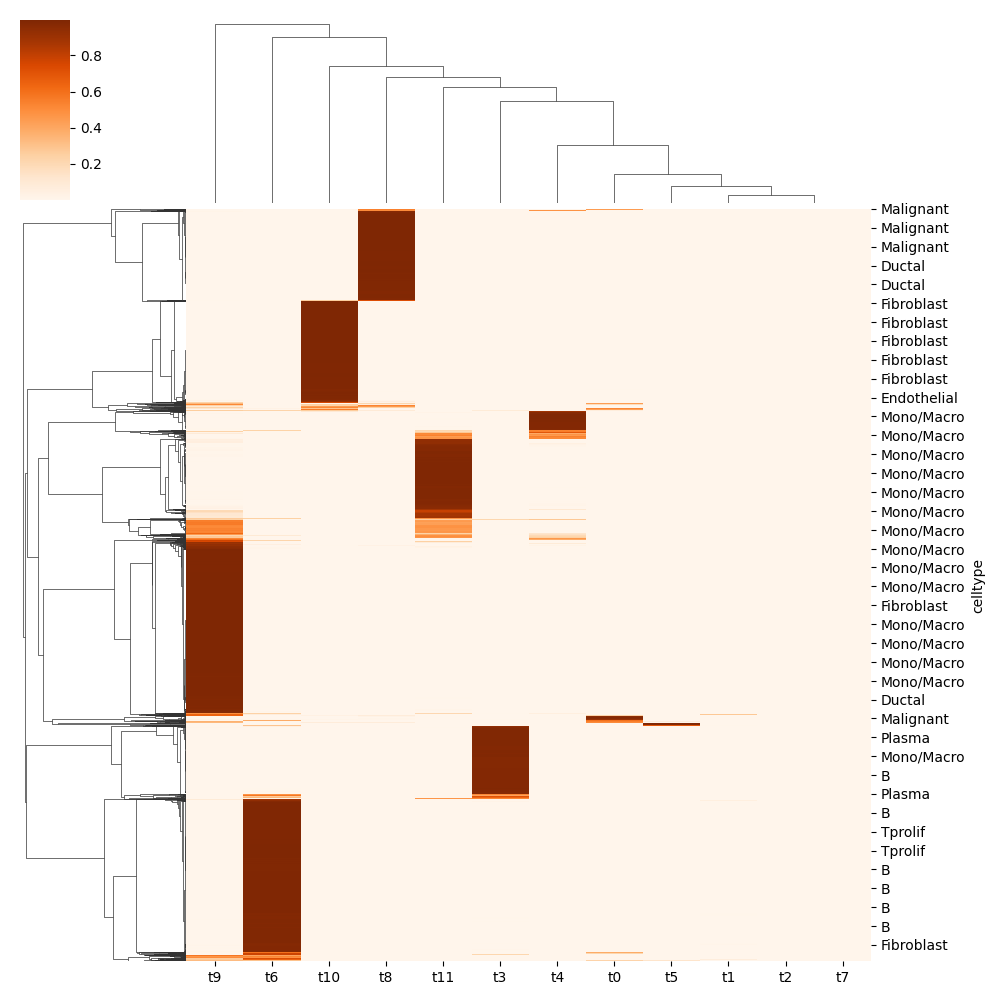

## ASAP : Annotation of Single-cell data by Approximate Pseudobulk projection


<div align="center">
    
</div>


### This is a project repository for -
* Subedi, S., Sumida, T. S., & Park, Y. P. (2024) <a href="https://www.life-science-alliance.org/content/7/10/e202402713">
A scalable approach to topic modelling in single-cell data by approximate pseudobulk projection. </a> Life Science Alliance 7 (10).

### Summary

ASAP, short for Annotating a Single-cell data matrix by Approximate Pseudobulk estimation, is a scalable annotation method customized for single-cell RNA-seq data analysis. The method is based on probabilistic topic assignments where for each cell, we identify the latent representation of cellular states. A dictionary matrix, consisting of topic-specific gene frequency vectors, provides interpretable bases to be compared with known cell type–specific marker genes and other pathway annotations. Our approach is more accurate than existing methods but requires orders of magnitude less computing time and much lower memory consumption.

# Quickstart

## ASAP installation:


```

#OS requirements:
sudo apt install cmake
sudo apt install libeigen3-dev
sudo apt-get install libboost-all-dev


# PYTHON 
pip install asappy
```

We will first create a separate directory 'example' for analysis and add dataset in data directory. The dataset can be created from multiple or single source dataset in H5 or H5AD format.


```
mkdir example
cd example
mkdir data
mkdir results
```
Import libraries

```
import asappy
import anndata as an

import pandas as pd
import numpy as np

import matplotlib.pylab as plt
import seaborn as sns

```

## Create ASAP data

For illustration purpose, we use pancreatic ductal adenocarcinoma data from <a href="https://pubmed.ncbi.nlm.nih.gov/34326696/">(Zhao et al,2021a - GSE165399).</a> The h5 version of this data can be downloaded from <a href="http://tisch.comp-genomics.org/gallery/?cancer=PAAD&species="> TISCH database.</a>

```
sample = 'pancreas'
wdir = 'example/'

asappy.create_asap_data(sample,working_dirpath=wdir)
```

## Create ASAP object 

Next, we create ASAP object and link dataset to it. Depending on the size of data_size, the object will load the data on memory or setup on-disk option to run further analysis.
- if total size of the data is less than data_size then load on memory else run analysis on-disk


```
data_size = 10000
number_batches = 1
asap_object = asappy.create_asap_object(sample=sample,data_size=data_size,number_batches=number_batches,working_dirpath=wdir)

```

## Generate pseudobulk

```
asappy.generate_pseudobulk(asap_object,tree_depth=10)
```

## Run NMF
```
n_topics = 12 
asappy.asap_nmf(asap_object,num_factors=n_topics,seed=42)

## save model
# asappy.generate_model(asap_object)
# asap_object = asappy.generate_model(asap_object,return_object=True)
```

## Analysis

Next, we use Leiden clustering to cluster cells. 

```

## read ASAP object
asap_object = an.read_h5ad(wdir+'results/'+sample+'.h5asap')

cluster_resolution= 0.3 
asappy.leiden_cluster(asap_object,resolution=cluster_resolution)
asappy.run_umap(asap_object,distance='euclidean',min_dist=0.3)

## plot cluster umap
asappy.plot_umap(asap_object,col='cluster',pt_size=2.5,ftype='png')

```
<div align="center">

</div>

We can add celltype label to the UMAP.

```
# a getct function gets cell type annotation from the previous study

asap_object.obs['celltype']  = pd.Categorical(getct(asap_object.obs.index.values,sample))
asappy.plot_umap(asap_object,col='celltype',pt_size=2.5,ftype='png')

```
<div align="center">

</div>

Plot top 10 genes from gene-by-factor beta matrix 

```
top_n_genes = 10
asappy.plot_gene_loading(asap_object,top_n=top_n_genes)

```
<div align="center">

</div>

Plot cell-by-factor theta matrix.
```
pmf2t = asappy.pmf2topic(beta=asap_object.uns['pseudobulk']['pb_beta'] ,theta=asap_object.obsm['theta'])
df = pd.DataFrame(pmf2t['prop'])
df.columns = ['t'+str(x) for x in df.columns]
df['celltype'] = asap_object.obs['celltype'].values
df.set_index('celltype',inplace=True)


sns.clustermap(df,cmap='Oranges')
plt.savefig(asap_object.uns['inpath']+'_prop_hmap.png');plt.close()
```

<div align="center">

</div>
