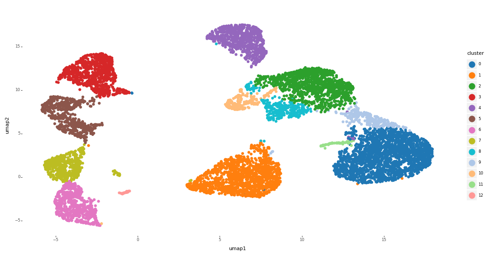
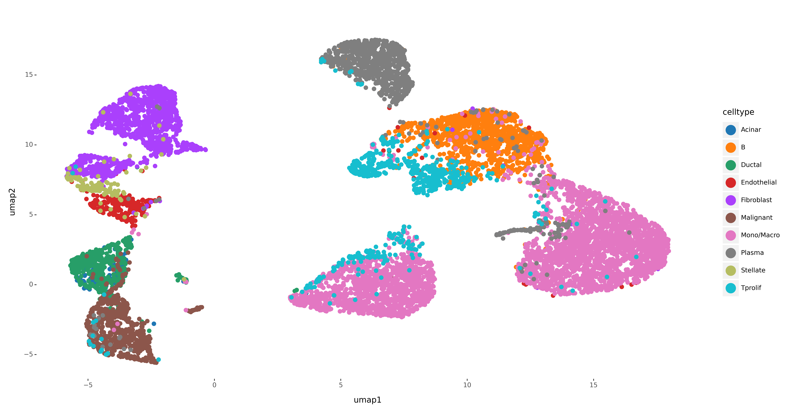
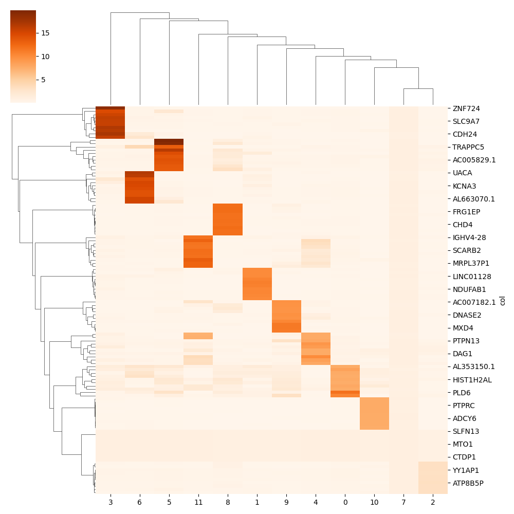
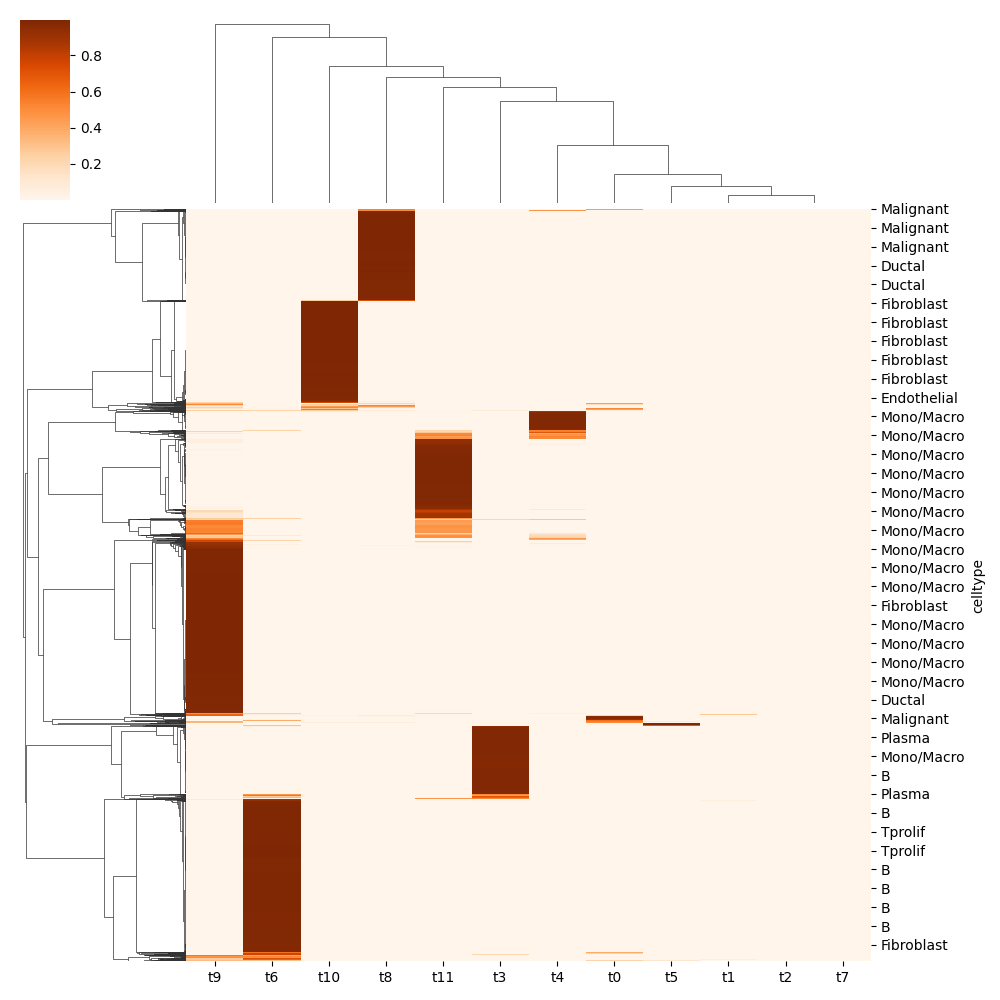

# Quickstart

## ASAPP installation:


```

#OS requirements:
sudo apt install cmake
sudo apt install libeigen3-dev
sudo apt-get install libboost-all-dev


pip install asappy
```


We will first create a separate directory 'example' for analysis and add dataset in data directory. The dataset can be created from multiple or single source dataset in H5, H5AD, and MTX format.

```
mkdir example
cd example
mkdir data
mkdir results
```
Import libraries

```
import asappy
import anndata as an

import pandas as pd
import numpy as np

import matplotlib.pylab as plt
import seaborn as sns

```

## Create ASAPP data
```
sample = 'pancreas'
wdir = 'example/'

asappy.create_asap_data(sample,working_dirpath=wdir)
```

## Create ASAPP object 

Next, we create ASAPPY object and link dataset to it. Depending on the size of data_size, the object will load the data on memory or setup on-disk option to run further analysis.
- if total size of the data is less than data_size then load on memory else run alaysis on-disk


```
data_size = 10000
number_batches = 1
asap_object = asappy.create_asap_object(sample=sample,data_size=data_size,number_batches=number_batches,working_dirpath=wdir)

```

## Generate pseudo-bulk

```
asappy.generate_pseudobulk(asap_object,tree_depth=10)
```

## Run NMF
```
n_topics = 12 
asappy.asap_nmf(asap_object,num_factors=n_topics,seed=42)

## save model
# asappy.generate_model(asap_object)
# asap_object = asappy.generate_model(asap_object,return_object=True)
```

## Analysis

Next, we use Leiden clustering to cluster cells. 

```

## read ASAPP object
asap_object = an.read_h5ad(wdir+'results/'+sample+'.h5asap')

cluster_resolution= 0.3 
asappy.leiden_cluster(asap_object,resolution=cluster_resolution)
asappy.run_umap(asap_object,distance='euclidean',min_dist=0.3)

## plot cluster umap
asappy.plot_umap(asap_object,col='cluster',pt_size=2.5,ftype='png')

```
<div align="center">

</div>

We can add celltype label to the UMAP.

```
def getct(ids,sample):
	ids = [x.replace('@'+sample,'') for x in ids]
	dfid = pd.DataFrame(ids,columns=['cell'])
	dfl = pd.read_csv(wdir+'results/'+sample+'_celltype.csv.gz')
	dfl['cell'] = [x.replace('@'+sample,'') for x in dfl['cell']]
	dfjoin = pd.merge(dfl,dfid,on='cell',how='right')
	ct = dfjoin['celltype'].values
	return ct

asap_object.obs['celltype']  = pd.Categorical(getct(asap_object.obs.index.values,sample))
asappy.plot_umap(asap_object,col='celltype',pt_size=2.5,ftype='png')

```
<div align="center">

</div>

Plot top 10 genes from gene-by-factor beta matrix 

```
top_n_genes = 10
asappy.plot_gene_loading(asap_object,top_n=top_n_genes)

```
<div align="center">

</div>

Plot cell-by-factor theta matrix.
```
pmf2t = asappy.pmf2topic(beta=asap_object.uns['pseudobulk']['pb_beta'] ,theta=asap_object.obsm['theta'])
df = pd.DataFrame(pmf2t['prop'])
df.columns = ['t'+str(x) for x in df.columns]
df['celltype'] = asap_object.obs['celltype'].values
df.set_index('celltype',inplace=True)


sns.clustermap(df,cmap='Oranges')
plt.savefig(asap_object.uns['inpath']+'_prop_hmap.png');plt.close()
```

<div align="center">

</div>